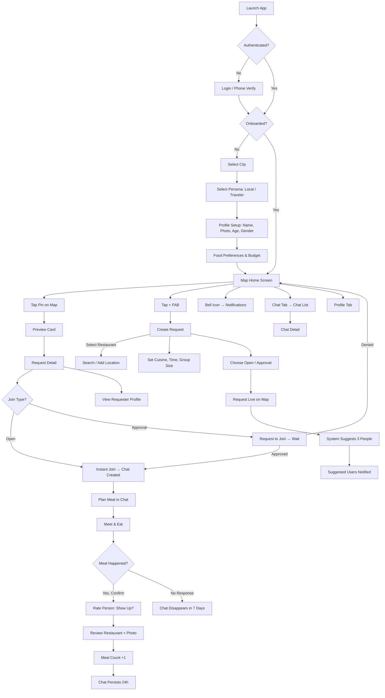
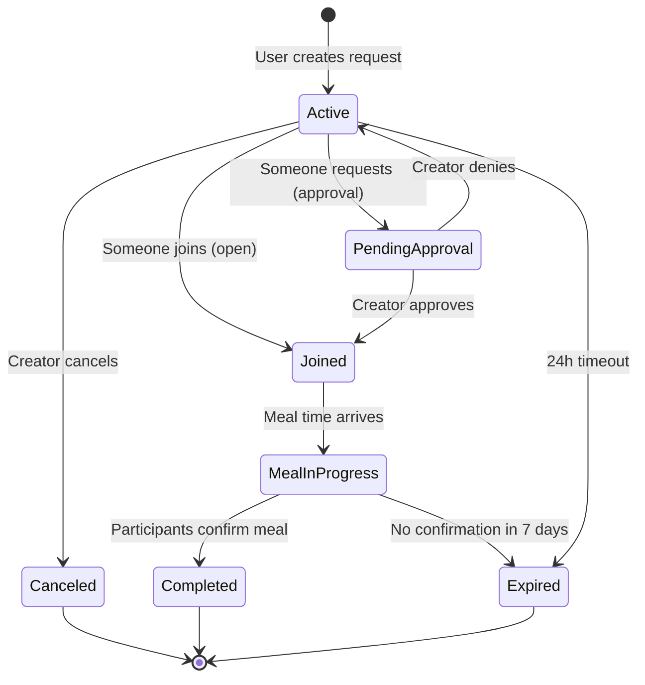
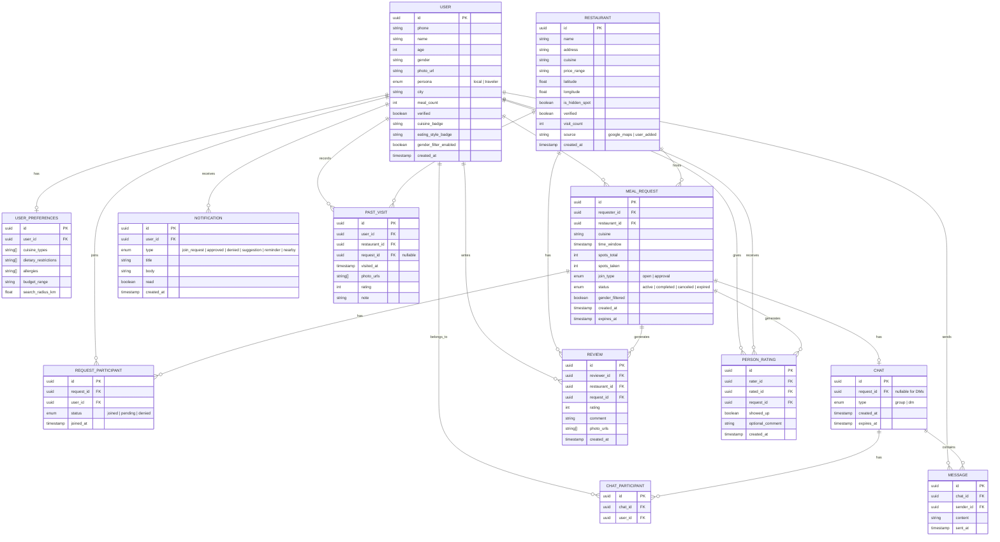

# Chopsticks — Flow & Data Diagrams

## 1. User Flow

## 2. Request Lifecycle

## 3. Database Schema (ER Diagram)

## 4. Notes

- **PAST_VISIT** table is designed but **not built in v1**. It will track user visits to restaurants with date, photos, rating, and optional notes. Useful for building a personal food diary and powering recommendations.
- **gender_filter_enabled** on USER controls whether their requests are hidden from male-identified users.
- **gender_filtered** on MEAL_REQUEST marks requests that should only be visible to women + queer users.
- **source** on RESTAURANT tracks whether it was seeded from Google Maps or user-added.
- **is_hidden_spot** on RESTAURANT is set to true for user-added locations verified via photo.
