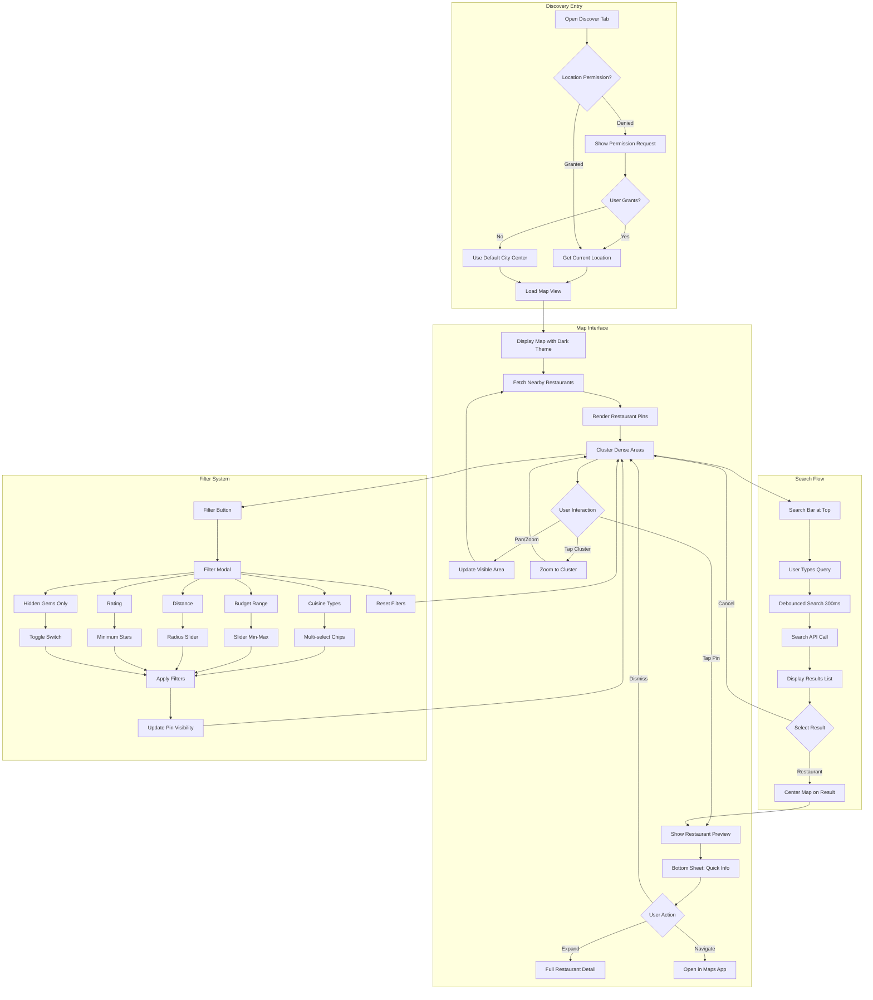
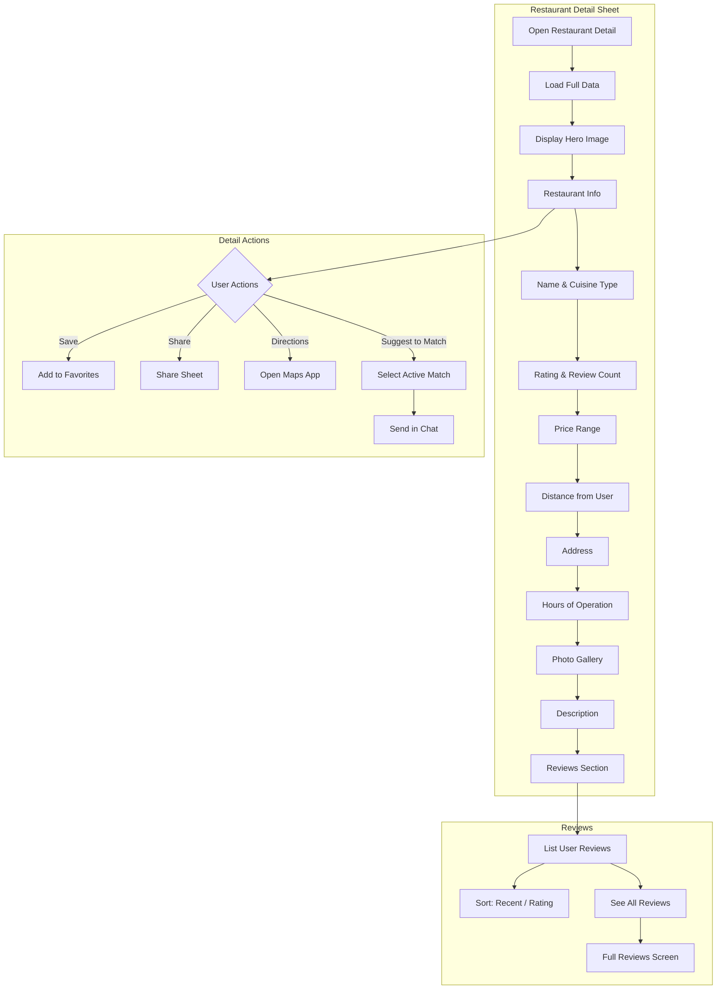
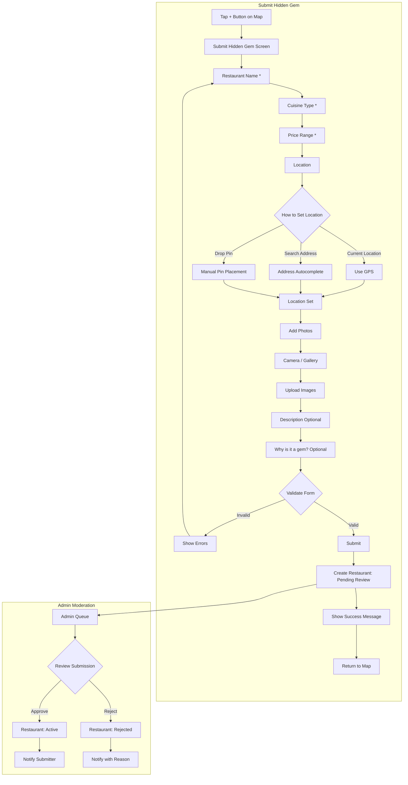
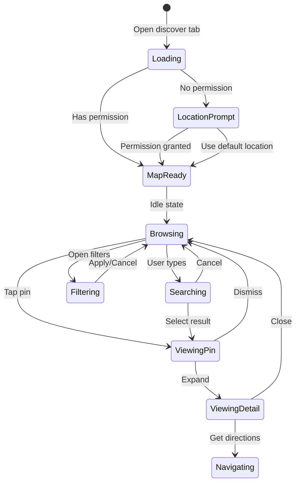
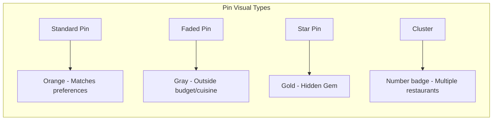
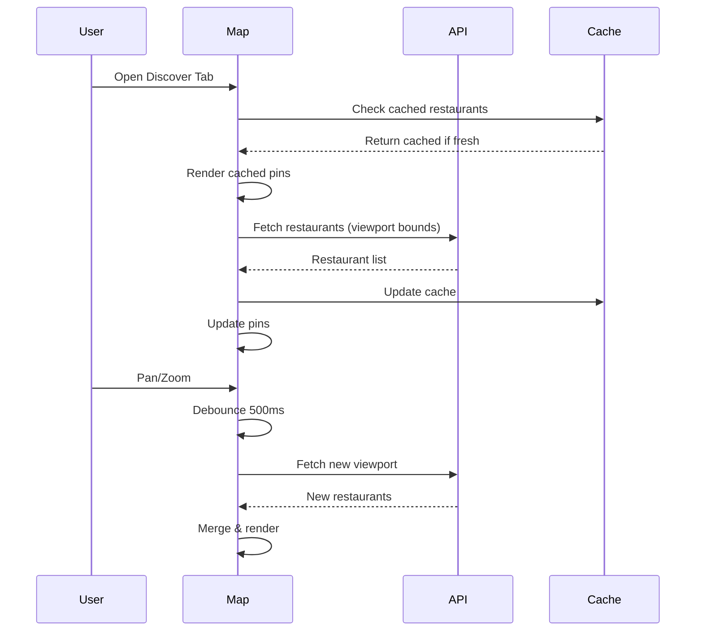

# Discovery Map Flow

## Main Discovery Flow

## Restaurant Detail Flow

## Submit Hidden Gem Flow

## Map Component States

## Restaurant Pin Types

## Data Loading Strategy

## Filter Persistence

| Filter | Default | Persisted |
|--------|---------|-----------|
| Cuisine Types | User preferences | Yes (local) |
| Budget Range | User preferences | Yes (local) |
| Distance | 5km | Yes (local) |
| Min Rating | None | No |
| Hidden Gems Only | Off | No |
