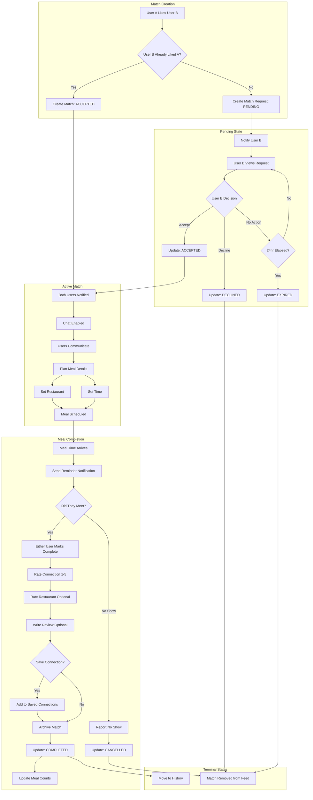
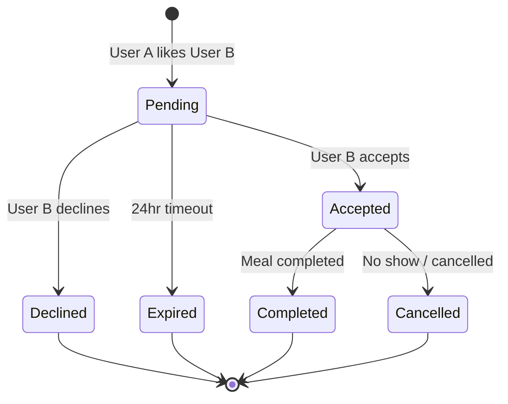
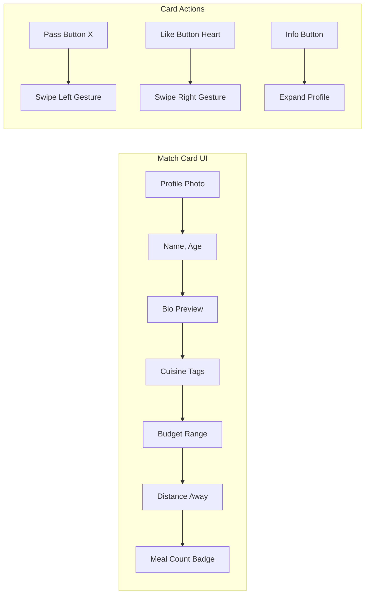

# Match Feed & Lifecycle Flow

## Match Feed Flow

```mermaid
flowchart TD
    subgraph MatchFeed["Match Feed Screen"]
        A[Open Match Feed] --> B{Has Matches?}
        B -->|No| C[Show Empty State]
        C --> D[Adjust Preferences CTA]
        D --> E[Go to Preferences]

        B -->|Yes| F[Display Match Cards]
        F --> G[View Current Card]

        G --> H{User Action}
        H -->|Swipe Left / Pass| I[Skip User]
        I --> J{More Cards?}
        J -->|Yes| G
        J -->|No| K[Show "No More Matches"]
        K --> L[Check Back Later / Expand Radius]

        H -->|Swipe Right / Like| M[Send Match Request]
        M --> N{Mutual Match?}
        N -->|Yes - Other Already Liked| O[Show Match Animation]
        O --> P[Open Chat]
        N -->|No - Pending| Q[Show "Request Sent"]
        Q --> J

        H -->|Tap Card| R[View Full Profile]
        R --> S[Profile Details Modal]
        S --> T{Action from Profile}
        T -->|Like| M
        T -->|Pass| I
        T -->|Close| G
    end

    subgraph Filters["Feed Filters"]
        F --> U[Filter Options]
        U --> V[Cuisine Filter]
        U --> W[Budget Filter]
        U --> X[Distance Filter]
        U --> Y[Available Time Filter]
        V & W & X & Y --> Z[Apply Filters]
        Z --> F
    end
```

## Match Lifecycle Flow



## Match States



## Match Card Component



## Notifications

| Event | Notification | Deep Link |
|-------|--------------|-----------|
| New match request | "Sarah wants to grab food with you!" | Match detail |
| Match accepted | "It's a match! Start chatting with Sarah" | Chat screen |
| Match expiring | "Your match with Sarah expires in 2 hours" | Match detail |
| Meal reminder | "Your meal with Sarah is in 1 hour" | Chat screen |
| Match expired | "Your match with Sarah has expired" | Match feed |
